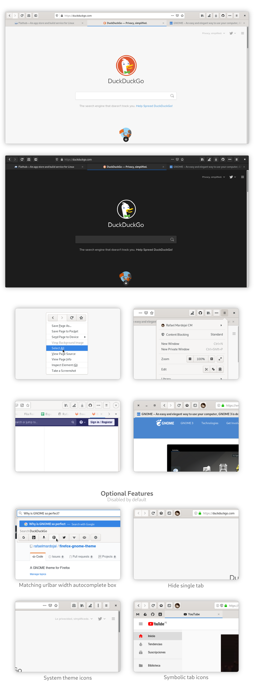

<h1 align="center">
	<br>
 Firefox GNOME theme
</h1>

[](https://github.com/rafaelmardojai/firefox-gnome-theme/blob/master/LICENSE)
[](https://paypal.me/RafaelMardojaiCM)

<p align="center"><strong>A GNOME theme for Firefox</strong></p>

<p align="center">This theme follows lastest GNOME Adwaita style.</p>



## Description

This is a bunch of CSS code to make Firefox look closer to GNOME's native apps.

This theme is supposed to work with current supported Firefox releases:

- Firefox 83
- Firefox 78 ESR
- Firefox 84 Beta
- Firefox 85 Nightly

## Installation

### Installation script
1. Clone this repo and enter folder:
	```sh
	git clone https://github.com/rafaelmardojai/firefox-gnome-theme/ && cd firefox-gnome-theme
	```

2. Run installation script:
	```sh
	./scripts/install.sh # Standard
	./scripts/install.sh -f ~/.var/app/org.mozilla.firefox/.mozilla/firefox # Flatpak
	```

#### Script options
- `-f <firefox_folder_path>` *optional*
	- Set custom Firefox folder path, for example `~/.mozilla/icecat/`.
	- Default: `~/.mozilla/firefox/`

- `-p <profile_name>` *optional*
	- Set custom profile name, for example `e0j6yb0p.default-nightly`.
	- Default: standard default profile
- `-t <theme_name>` *optional*
	- Set the colors used in the theme.
	- Default: Adwaita.
	- Options: `adwaita`, `maia`, `yaru`.
	
### One command curled script

You can also install this theme with one command:

`curl -s -o- https://raw.githubusercontent.com/rafaelmardojai/firefox-gnome-theme/master/scripts/install-by-curl.sh | bash`

It will download the latest version of the theme and run the installation script for you.

### Manual installation
1. Go to `about:support` in Firefox.

2. Application Basics > Profile Directory > Open Directory.

3. Open directory in a terminal.

4. Create a `chrome` directory if it doesn't exist:

	```sh
	mkdir -p chrome
	cd chrome
	```

5. Clone this repo to a subdirectory:

	```sh
	git clone https://github.com/rafaelmardojai/firefox-gnome-theme.git
	```

6. Create single-line user CSS files if non-existent or empty (at least one line is needed for `sed`):

	```sh
	[[ -s userChrome.css ]] || echo >> userChrome.css
	```

7. Import this theme at the beginning of the CSS files (all `@import`s must come before any existing `@namespace` declarations):

	```sh
	sed -i '1s/^/@import "firefox-gnome-theme\/userChrome.css";\n/' userChrome.css
	```

8. Symlink preferences file:

	```sh
	ln -s chrome/firefox-gnome-theme/configuration/user.js ../user.js
	```

9. Restart Firefox.

10. Open Firefox customization panel and move the new tab button to headerbar.

11. Be happy with your new gnomish Firefox.

## Updating
Both manual and script installation methods should create a git clone in `your-profile-folder-path/chrome/firefox-gnome-theme`, so the easiet way to update the theme is to open this folder in terminal and perform a git pull.

```sh
git pull origin master
```

> Note: You can also run the installation script again to update (after cloning again the repo).

## Uninstalling
1. Go to your profile folder. (Go to `about:support` in Firefox > Application Basics > Profile Directory > Open Directory)
2. Remove `chrome` folder.

## Scrollbars
To achieve Firefox with overlay scrollbars install [firefox-gnome-scrollbars](https://github.com/rafaelmardojai/firefox-gnome-scrollbars).

## Enabling optional features
Optional features can be enabled by crating new `boolean` preferences in `about:config`.

1. Go to the `about:config` page 
2. Type the key of the feature you want to enable
3. Set it as a `boolean` and click on the add button
4. Restart Firefox

### Features

- **Hide single tab** `gnomeTheme.hideSingleTab`

	Hide the tab bar when only one tab is open.

	> **Note:** You should move the new tab button somewhere else for this to work, because by default it is on the tab bar too. See [#54](https://github.com/rafaelmardojai/firefox-gnome-theme/issues/54).

- **Normal width tabs** `gnomeTheme.normalWidthTabs`

	Use normal width tabs as default Firefox.

- **Active tab contrast** `gnomeTheme.activeTabContrast`

	Add more contrast to the active tab.

- **System icons** `gnomeTheme.systemIcons`

	Use system theme icons instead of Adwaita icons included by theme.

	> **Note:** This feature has a [known color bug](#icons-color-broken-with-system-icons).

- **Symbolic tab icons** `gnomeTheme.symbolicTabIcons`

	Make all tab icons look kinda like symbolic icons.

- **Drag window from headerbar buttons** `gnomeTheme.dragWindowHeaderbarButtons`

	Allow draging the window from headerbar buttons.

	> **Note:** This feature is BUGGED. It can activate the button with unpleasant behavior.

## Known bugs

### CSD have sharp corners
See upstream [bug](https://bugzilla.mozilla.org/show_bug.cgi?id=1408360).

#### Wayland fix:
1. Go to the `about:config` page
2. Search for the `layers.acceleration.force-enabled` preference and set it to true.
3. Now restart Firefox, and it should look good!

#### X11 fix:
1. Go to the `about:config` page 
2. Type `mozilla.widget.use-argb-visuals`
3. Set it as a `boolean` and click on the add button
4. Now restart Firefox, and it should look good!

### Icons color broken with System icons
Icons might appear black where they should be white on some systems. I have no idea why, but you can adjust them directly in the `system-icons.css` file, look for `--gnome-icons-hack-filter` & `--gnome-window-icons-hack-filter` vars and play with css filters.

## Development

If you wanna mess around the styles and change something, you might find these
things useful.

To use the Inspector to debug the UI, open the developer tools (F12) on any
page, go to options, check both of those:

- Enable browser chrome and add-on debugging toolboxes
- Enable remote debugging

Now you can close those tools and press Ctrl+Alt+Shift+I to Inspect the browser
UI.

Also you can inspect any GTK3 application, for example type this into a terminal
and it will run Epiphany with the GTK Inspector, so you can check the CSS styles
of its elements too.

```sh
GTK_DEBUG=interactive epiphany
```

Feel free to use any parts of my code to develop your own themes, I don't force
any specific license on your code.

## Credits
Developed by **[Rafael Mardojai CM](https://github.com/rafaelmardojai)** and [contributors](https://github.com/rafaelmardojai/firefox-gnome-theme/graphs/contributors). Based on **[Sai Kurogetsu](https://github.com/kurogetsusai/firefox-gnome-theme)** original work.

## Donate
If you want to support development, consider donating via [PayPal](https://paypal.me/RafaelMardojaiCM). Also consider donating upstream, [Firefox](https://donate.mozilla.org/) & [GNOME](https://www.gnome.org/support-gnome/).
